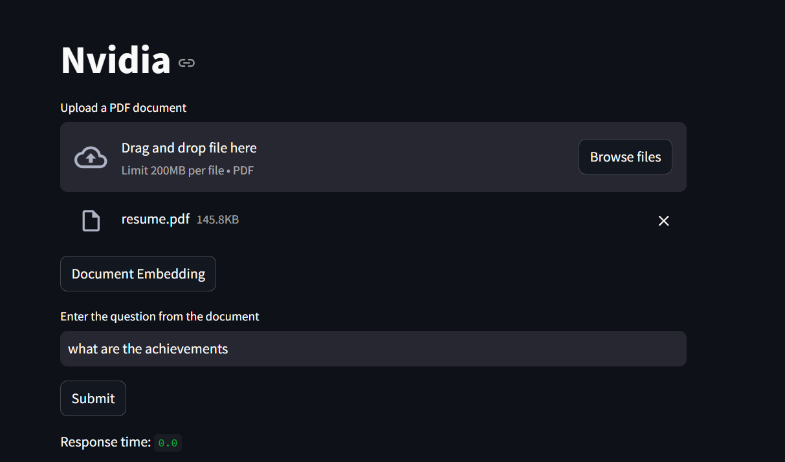
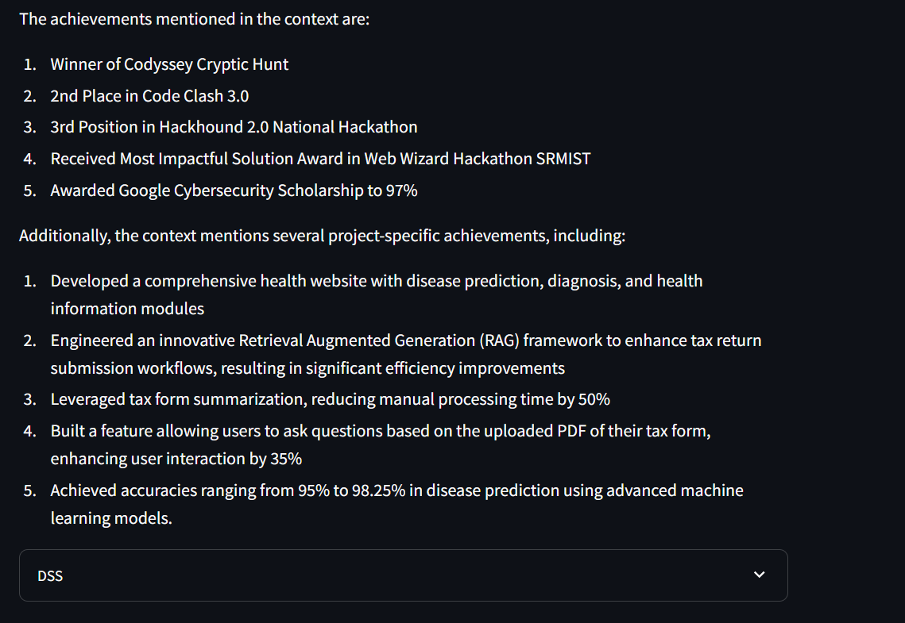

# Document Retrieval and Q&A with LangChain, NVIDIA AI, and Streamlit

This project demonstrates how to build a document retrieval and question-answering application using LangChain, NVIDIA AI models, and Streamlit. Users can upload a PDF document, embed its contents into vectors, and ask questions based on the document's content. The system retrieves relevant information from the document and provides answers using NVIDIA's AI models.

## Features

- Upload and process PDF documents.
- Embed document contents into vector representations.
- Retrieve and answer questions based on the document content using NVIDIA AI models.
- Interactive user interface with Streamlit.

## Usage




## Installation

1. **Clone the Repository:**
   ```bash
   git clone https://github.com/Kushaagra-exe/Simple-RAG-Nvidia
   cd Simple-RAG-Nvidia
   ```

2. **Create a Virtual Environment:**
   ```bash
   python -m venv env
   source env/bin/activate  # On Windows use `env\Scripts\activate`
   ```

3. **Install Dependencies:**
   ```bash
   pip install -r requirements.txt
   ```

4. **Set Up NVIDIA API Key:**
   - Open `.env` file and add your NVIDIA API key:
     ```env
     NVIDIA_API=your_api_key_here
     ```
   - Alternatively, enter the API key directly through the Streamlit sidebar when running the app.

## Usage

1. **Run the Streamlit App:**
   ```bash
   streamlit run app.py
   ```

2. **Upload a PDF Document:**
   - Click on the "Upload a PDF document" button in the Streamlit app.
   - Choose a PDF file to upload.

3. **Embed the Document:**
   - Click on the "Document Embedding" button to process and embed the document contents.

4. **Ask a Question:**
   - Enter a question related to the uploaded document in the input field.
   - Click "Submit" to get an answer based on the document content.

## Project Structure

- `app.py`: Main Streamlit application file.
- `requirements.txt`: Contains the list of Python dependencies.
- `.env`: Environment file to store sensitive information like the NVIDIA API key.

## Dependencies

- `streamlit`: For building the web interface.
- `langchain_nvidia_ai_endpoints`: For integrating NVIDIA AI models.
- `langchain_community`: For document loaders and vector stores.
- `langchain_core`: For text splitting and chain creation.
- `FAISS`: For creating vector stores.

## API Key Configuration

You can configure the NVIDIA API key in two ways:

1. **Via `.env` File:**
   - Create a `.env` file in the root directory.
   - Add your API key as follows:
     ```env
     NVIDIA_API=your_api_key_here
     ```

2. **Via Streamlit Sidebar:**
   - Enter the API key directly in the input field provided in the Streamlit sidebar.

